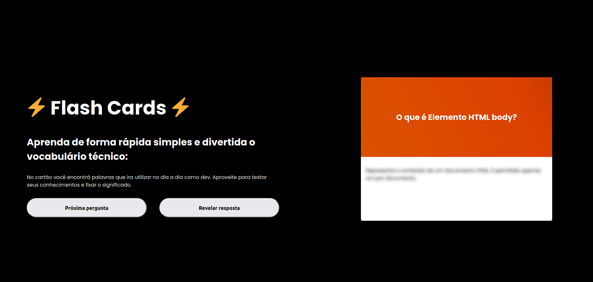

  <h1>Flash Cards </h1>
  Repositorio criado com o objetivo de estudar HTML, CSS e JavaScript.

  Flash Cards que podem ser usados para estudar, utilizando a API fornecida no evento Quick Start.

https://flashcardquiliao.netlify.app/
